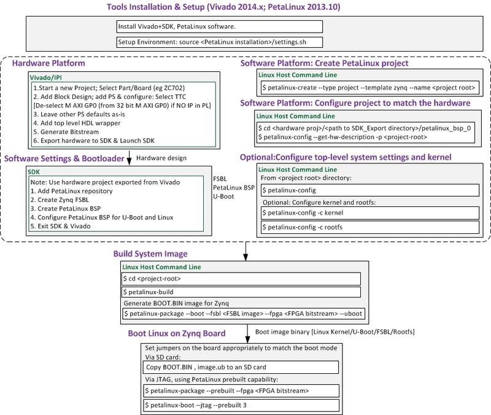

# Setup Linux System on Zybo (zynq7010)
Document the process to setup linux on Zybo (zynq 7010) board.

## Prerequesites
* PetaLinux 2017.4 (installed at /opt/pkg/petalinux)
* Vivado 2017.4 (installed at /opt/Xilinx/Vivado/2017.4)

## Setup SD Card
* Use gparted on Ubuntu 16.04 LTS. Make sure SD card is unmounted (e.g. $sudo umount /media/<username>/E7A7-5FF9)
* Create two partitions:
	* 512MB, FAT32, Label:BOOT (make sure 4MB "free space proceeding" this partition)
	* All the rest of the SD card, EXT4, Label: ROOT_FS

## Root File System
Candidates to download (select one of them):
* [Linaro 17.08 (350MB)](http://releases.linaro.org/debian/images/developer-armhf/17.08/linaro-stretch-developer-20170706-43.tar.gz)
	* sudo tar xf linaro-jessie-developer-20161117-32.tar.gz --strip-components=1 -C <path>/ROOT_FS/
* [Ubuntu 16.04.4 minimal (134MB)](https://rcn-ee.com/rootfs/eewiki/minfs/ubuntu-16.04.4-minimal-armhf-2018-03-26.tar.xz)
	* tar xf ubuntu-16.04.2-minimal-armhf-2017-06-18.tar.xz
	* sudo tar xfvp ./*-*-*-armhf-*/armhf-rootfs-*.tar -C /media/rootfs/
	* sync
	* sudo chown root:root /media/rootfs/
	* sudo chmod 755 /media/rootfs/
* [Debian 9.4 minimal (127MB)](https://rcn-ee.com/rootfs/eewiki/minfs/debian-9.4-minimal-armhf-2018-03-26.tar.xz)

## Petalinux 

Petalinux design flow is shown in the diagram, which is copied from [`Xilinx: PetaLinux Gettomg Started`](http://www.wiki.xilinx.com/PetaLinux+Getting+Started).



### Intall Petalinux tools
* Petalinux setup follows the guidelines found [here](https://github.com/Digilent/Petalinux-Zybo). It uses Petalinux 2017.4
* Dependency and prerequesites:
```
sudo -s
apt-get install tofrodos gawk xvfb git libncurses5-dev tftpd zlib1g-dev zlib1g-dev:i386  \
                libssl-dev flex bison chrpath socat autoconf libtool texinfo gcc-multilib \
                libsdl1.2-dev libglib2.0-dev screen pax 
reboot
```

* Install and configure the tftp server (this can be skipped if not interested in booting via TFTP)
```
sudo -s
apt-get install tftpd-hpa
chmod a+w /var/lib/tftpboot/
reboot
```

* Create petalinux install dir at /opt/pkg:
```
sudo -s
mkdir -p /opt/pkg/petalinux
chown <your_user_name> /opt/pkg/
chgrp <your_user_name> /opt/pkg/
chgrp <your_user_name> /opt/pkg/petalinux/
chown <your_user_name> /opt/pkg/petalinux/
exit
```

* Download installer from Xilinx and install
```
cd ~/Downloads
./petalinux-v2017.4-final-installer.run /opt/pkg/petalinux
```


### Source the petalinux tools

Whenever you want to run any petalinux commands, you will need to first start by opening a new terminal and "sourcing" the Petalinux environment settings (make sure you are using `bash`):

```
source /opt/pkg/petalinux/settings.sh
```

### Download the petalinux project

There are two ways to obtain the project. If you plan on version controlling your project you should clone this repository using the following:

```
git clone --recursive https://github.com/Digilent/Petalinux-Zybo.git
```
If you are not planning on version controlling your project and want a simpler release package, go to https://github.com/Digilent/Petalinux-Zybo/releases/
and download the most recent .bsp file available there for the version of Petalinux you wish to use.


### Generate project

If you have obtained the project source directly from github, then you should simply _cd_ into the Petalinux project directory. If you have downloaded the 
.bsp, then you must first run the following command to create a new project.

Foe this tutorial, we use [Petalinux-Zybo-2017.4-1.bsp](https://github.com/Digilent/Petalinux-Zybo/releases/download/v2017.4-1/Petalinux-Zybo-2017.4-1.bsp)

```
petalinux-create -t project -s <path to .bsp file>
```

This will create a new petalinux project in your current working directory, which you should then _cd_ into.


### Run the pre-built image from SD

(Note: The pre-built images are only included with the .bsp release. )

Copy _pre-built/linux/images/BOOT.BIN_ and _pre-built/linux/images/image.ub_ to the first partition of your SD card.

#### Or, alternatively, build image on your own as below.

### Configure petalinux-config

This project is initially configured to have the root file system (rootfs) existing in RAM. This configuration is referred to as "initramfs". A key aspect of this configuration is that changes made to the files (for example in your /home/root/ directory) will not persist after the board has been reset. This may or may not be desirable functionality.

Another side affect of initramfs is that if the root filesystem becomes too large (which is common if you add many features with "petalinux-config -c rootfs) then the system may experience poor performance (due to less available system memory). Also, if the uncompressed rootfs is larger than 128 MB, then booting with initramfs will fail unless you make modifications to u-boot (see note at the end of the "Managing Image Size" section of UG1144).

For those that want file modifications to persist through reboots, or that require a large rootfs, the petalinux system can be configured to instead use a filesystem that exists on the second partition of the microSD card. This will allow all 512 MiB of memory to be used as system memory, and for changes that are made to it to persist in non-volatile storage. To configure the system to use SD rootfs, write the generated root fs to the SD, and then boot the system, do the following:

Start by running 
```
petalinux-config
```
and setting the following option to "SD":
```
 -> Image Packaging Configuration -> Root filesystem type
```

Next, open project-spec/meta-user/recipes-bsp/device-tree/files/system-user.dtsi in a text editor and locate the "bootargs" line. It should read as follows:

`
		bootargs = "console=ttyPS0,115200 earlyprintk uio_pdrv_genirq.of_id=generic-uio";
`

Replace that line with the following before saving and closing system-user.dtsi:

`
		bootargs = "console=ttyPS0,115200 earlyprintk uio_pdrv_genirq.of_id=generic-uio root=/dev/mmcblk0p2 rw rootwait";
`

### Configure linux kernel
(See kernel customization details in 'USB wifi dongle' section below)
```
petalinux-config -c kernel
```
For example, Set (to 'y') the following options (leave any additional options that appear as their defaults):
Networking Support -> Wireless -> cfg80211 - wireless configuration API
Networking Support -> Wireless -> Generic IEEE 802.11 Networking Stack (mac80211)
Device Drivers -> Network device support -> Wireless LAN
Device Drivers -> Network device support -> Wireless LAN -> Realtek rtlwifi family of devices -> Realtek RTL8192CU/RTL8188CU USB Wireless Network
Device Drivers-> Multimedia support->
Media USB Adapters -> USB Video Class (UVC)
Device Drivers -> DMA engine support -> Async_tx: Offload support for the async_tx api
Floating point emulation -> Support for NEON in kernel mode
...

### Build the petalinux project

Run the following commands to build the petalinux project with the default options (before build, you can _customize your kernel_, e.g. enable wifi usb dongle as mentioned in next session):

```
petalinux-build
petalinux-package --boot --force --fsbl images/linux/zynq_fsbl.elf --fpga images/linux/system_wrapper.bit --u-boot
```

To boot the newly built files from SD, copy the BOOT.BIN and image.ub files found in _images/linux_ to first partition of SD card.


### Use third-party root file system 
It is possible to use a third party prebuilt rootfs (such as a Linaro Ubuntu image) instead of the petalinux generated rootfs. To do this, just copy the prebuilt image to the second partition instead of running the "dd" command above. 

For example, uncompress the downloaded root FS to second partition of SD card (ext4 formatted partition labeled 'ROOT_FS') as below:

```
tar xf ubuntu-16.04.2-minimal-armhf-2017-06-18.tar.xz
sudo tar xfvp ./*-*-*-armhf-*/armhf-rootfs-*.tar -C <path>/ROOT_FS/
sync
sudo chown root:root /media/rootfs/
sudo chmod 755 /media/rootfs/
```

Or
```
sudo tar xf linaro-jessie-developer-20161117-32.tar.gz --strip-components=1 -C <path>/ROOT_FS/
```

If the kernel has been customized, '/lib/firmware' and '/lib/modules' should be installed appropriately. See details in below section 'USB wifi dongle issue'.


### Prepare for release

This section is only relevant for those who wish to upstream their work or version control their own project correctly on Github.
Note the project should be released configured as initramfs for consistency, unless there is very good reason to release it with SD rootfs.

```
petalinux-package --prebuilt --clean --fpga images/linux/system_wrapper.bit -a images/linux/image.ub:images/image.ub 
petalinux-build -x distclean
petalinux-build -x mrproper
petalinux-package --bsp --force --output ../releases/Petalinux-Zybo-20XX.X-X.bsp -p ./
cd ..
git status # to double-check
git add .
git commit
git push
```
Finally, open a browser and go to github to push your .bsp as a release.


## Misc issues 
### USB wifi dongle issue
When booting Ubuntu 16.04 on Zybo, 'lsusb' can recognize the device, but 'dmesg' shows the firmware is missing. Also, the wlan0 interface is renamed.

```
[    1.384246] rtl8192cu: Chip version 0x10
[    1.388345] random: fast init done
[    1.478134] rtl8192cu: Board Type 0
[    1.480484] rtl_usb: rx_max_size 15360, rx_urb_num 8, in_ep 1
[    1.484932] rtl8192cu: Loading firmware rtlwifi/rtl8192cufw_TMSC.bin
[    1.490266] ieee80211 phy0: Selected rate control algorithm 'rtl_rc'
[    1.492261] usb 1-1: Direct firmware load for rtlwifi/rtl8192cufw_TMSC.bin failed with error -2
[    1.499644] usb 1-1: Direct firmware load for rtlwifi/rtl8192cufw.bin failed with error -2
[    1.506550] rtlwifi: Loading alternative firmware rtlwifi/rtl8192cufw.bin
==> [    1.512010] rtlwifi: Selected firmware is not available
...
==> [    6.159224] rtl8192cu 1-1:1.0 wlx74da38e1db0d: renamed from wlan0

```
Solutions:
* Run below on Zybo from newly installed Ubuntu 16.04 to fetch packages
```
> sudo apt-get update
> sudo apt-get dist-upgrade 
(Note: The latter command installs linux-firmware package, which resolved the firmware missing error above in dmesg log.)
```
* Or, alternatively, build from source. The wifi/usb related drivers should be enabled from Linux kernel customization/build. Say, 
```
> source /<path_to_xilinx>/SDK/<version>/settings64.sh
> export CROSS_COMPILE=arm-xilinx-linux-gnueabi-
> export ARCH=arm
> export PATH=$HOME/tutorial/u-boot-Digilent-Dev/tools:$PATH
> git clone -b master-next https://github.com/DigilentInc/Linux-
Digilent-Dev.git 
(Here assuming building from separate sync'ed linux kernel source, say, Linux-Digilent-Dev, instead of petalinux maintained/fetched linux source)
> cd Linux-Digilent-Dev/
> make mrproper
> make xilinx_zynq_defconfig
> make ARCH=arm menuconfig
```
Set (to 'y') the following options (leave any additional options that appear as their defaults):
Networking Support -> Wireless -> cfg80211 - wireless configuration API
Networking Support -> Wireless -> Generic IEEE 802.11 Networking Stack (mac80211)
Device Drivers -> Network device support -> Wireless LAN
Device Drivers -> Network device support -> Wireless LAN -> Realtek rtlwifi family of devices -> Realtek RTL8192CU/RTL8188CU USB Wireless Network
Device Drivers-> Multimedia support->
Media USB Adapters -> USB Video Class (UVC)
Device Drivers -> DMA engine support -> Async_tx: Offload support for the async_tx api
Floating point emulation -> Support for NEON in kernel mode
...
```
> make UIMAGE_LOADADDR=0x8000 uImage modules
```
Then install/copy the lib/modules and lib/firmware directoris to /media/<user>/ROOT_FS/lib. 
We install the modules in the temporary directory:
```
make INSTALL_MOD_PATH=/tmp/ modules_install firmware_install
```
We will have to copy these modules to the le system that is mounted in
/media/ROOT_FS/ executing:
```
sudo cp -r /tmp/lib/modules/3.18.0-xilinx-46110-gd627f5d/
/media/ROOT_FS/lib/modules/
sudo cp -r /tmp/lib/firmware
/media/ROOT_FS/lib/
```
Where the directory 3.18.0-xilinx-46110-gd627f5d may be di erent in your
case. The build and source folders inside 3.18.0-xilinx-46110-gd627f5d are not
necessary and are symbolic links, so we eliminate them:
```
sudo rm -r /media/ROOT_FS/lib/modules/3.18.0-xilinx-46110-
gd627f5d/build
sudo rm -r /media/ROOT_FS/lib/modules/3.18.0-xilinx-46110-
gd627f5d/source
```
* (Optional) wlan0 renamed to wlx74da38e1db0d fix
```
> sudo ln -s  /dev/null /etc/udev/rules.d/80-net-setup-link.rules
> sudo reboot now
```

* Configure wifi dongle
Although 'lsusb' recognized the usb wifi dongle, it won't start working unless configuration.
First, create file /etc/wpa_supplicant.conf, which can be generated:
```
> wpa_passphrase networkname password > /etc/wpa_supplicant/wpa_supplicant.conf
```
The contents shows below. Passwd is encrypted, you might want to remove the commented psk line which reserves the read-in password for your network.
```
# reading passphrase from stdin
network={
        ssid="<FILL SSID NAME>"
        #psk="<FILL SSID PASSWD>" <= Delete this line
        psk=6b27dc00618ad243a972e94b80f4c4bd159ad971212176b56453373ba31c9189
}
```
Now, execute below:
```
ubuntu@arm:~$ cat wlan.connect.sh 
sudo iw dev
sudo ip link set wlan0 up
sudo wpa_supplicant -B -i wlan0 -c /etc/wpa_supplicant.conf
sudo iw wlan0 link
sudo dhclient wlan0
ping 8.8.8.8
```
Now 'wlan0' should show up when 'ifcofing':
```
```


### Configure SD rootfs built from petalinux

This project is initially configured to have the root file system (rootfs) existing in RAM. This configuration is referred to as "initramfs". A key 
aspect of this configuration is that changes made to the files (for example in your /home/root/ directory) will not persist after the board has been reset. 
This may or may not be desirable functionality.

Another side affect of initramfs is that if the root filesystem becomes too large (which is common if you add many features with "petalinux-config -c rootfs)
 then the system may experience poor performance (due to less available system memory). Also, if the uncompressed rootfs is larger than 128 MB, then booting
 with initramfs will fail unless you make modifications to u-boot (see note at the end of the "Managing Image Size" section of UG1144).

For those that want file modifications to persist through reboots, or that require a large rootfs, the petalinux system can be configured to instead use a 
filesystem that exists on the second partition of the microSD card. This will allow all 512 MiB of memory to be used as system memory, and for changes that 
are made to it to persist in non-volatile storage. To configure the system to use SD rootfs, write the generated root fs to the SD, and then boot the system, 
do the following:

Start by running petalinux-config and setting the following option to "SD":

```
 -> Image Packaging Configuration -> Root filesystem type
```

Next, open project-spec/meta-user/recipes-bsp/device-tree/files/system-user.dtsi in a text editor and locate the "bootargs" line. It should read as follows:

`
		bootargs = "console=ttyPS0,115200 earlyprintk uio_pdrv_genirq.of_id=generic-uio";
`

Replace that line with the following before saving and closing system-user.dtsi:

`
		bootargs = "console=ttyPS0,115200 earlyprintk uio_pdrv_genirq.of_id=generic-uio root=/dev/mmcblk0p2 rw rootwait";
`

(Note: If you wish to change back to initramfs in the future, you will need to undo this change to the bootargs line.)

Then run petalinux-build to build your system. After the build completes, your rootfs image will be at images/linux/rootfs.ext4.

Copy _images/linux/BOOT.BIN_ and _images/linux/image.ub_ to the first partition of your SD card.

Identify the /dev/ node for the second partition of your SD card using _lsblk_ at the command line. It will likely take the form of /dev/sdX2, where X is 
_a_,_b_,_c_,etc.. Then run the following command to copy the filesystem to the second partition:

#### Warning! If you use the wrong /dev/ node in the following command, you will overwrite your computer's file system. BE CAREFUL

```
sudo umount /dev/sdX2
sudo dd if=images/linux/rootfs.ext4 of=/dev/sdX2
sync
```

The following commands will also stretch the file system so that you can use the additional space of your SD card. Be sure to replace the
block device node as you did above:

```
sudo resize2fs /dev/sdX2
sync
```


## References
* [Installing Ubuntu on Xilinx ZYNQ-7000 AP SoC Using PetaLinux](https://medium.com/developments-and-implementations-on-zynq-7000-ap/install-ubuntu-16-04-lts-on-zynq-zc702-using-petalinux-2016-4-e1da902eaff7)
* fpga.org:
	* [Yet Another Guide to Running Linaro Ubuntu Linux Desktop on Xilinx Zynq on the ZedBoard](http://fpga.org/2013/05/24/yet-another-guide-to-running-linaro-ubuntu-desktop-on-xilinx-zynq-on-the-zedboard/)
	* How to Design and Access a Memory-Mapped Device in Programmable Logic from Linaro Ubuntu Linux on Xilinx Zynq on the ZedBoard, Without Writing a Device Driver. [Part One](http://fpga.org/2013/05/28/how-to-design-and-access-a-memory-mapped-device-part-one/), [Part Two](http://fpga.org/2013/05/28/how-to-design-and-access-a-memory-mapped-device-part-two/).
* Sven Andersson's [Zynq Design From Scratch](svenand.blogdrives.com):
	* [Running Linaro Ubuntu on the Zedbaord](http://svenand.blogdrives.com/archive/199.html#.Wv0KH9ZlBhG)
* [Connect to wifi from linux cmdline](https://linuxconfig.org/connect-to-wifi-from-the-linux-command-line)
